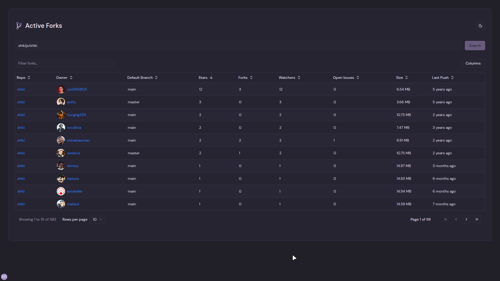

# Active Forks

A app that shows the active forks of a GitHub repository.

## Features

Search for forks by name
Filter by owner, default branch, stars, forks, watchers, open issues, size, and last push date
Sort by stars, forks, watchers, open issues, size, and last push date
Recursively search fork networks
Responsive design

View forks on GitHub
View forks on GitLab (might come soon)
View forks on Bitbucket (might come soon)
View forks on Gitea (might come soon)


This might be outdated, but it's the best I could do.

## TODO

For todos, work in progress, and ideas, see [the project board](https://github.com/users/Souvlaki42/projects/3).

## Getting Started

First, fork the repo and clone it.

Then, install the dependencies:

```bash
pnpm install
# or
yarn install
# or
npm install
```

### GitHub API

You need to have a GitHub API token with the `repo` scope. You can create a new token [here](https://github.com/settings/tokens/new).

Once you have the token, you need to set the `GITHUB_API_TOKEN` environment variable to the token.

Lastly, run the development server:

```bash
pnpm dev
# or
yarn dev
# or
npm run dev
```

And open [http://localhost:3000](http://localhost:3000) with your browser to see the result.

## License

This project is licensed under the [Apache License 2.0](LICENSE) license.

This project is a fork of [active-forks](https://github.com/techgaun/active-forks) by [techgaun](https://github.com/techgaun).
