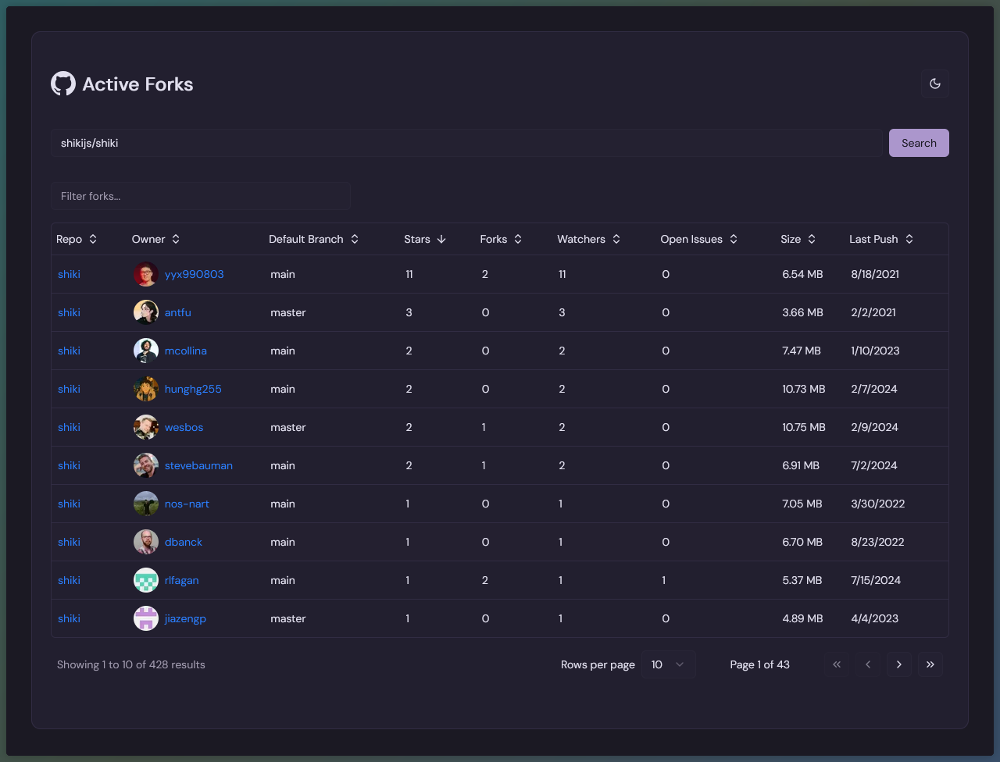

# Active Forks

A app that shows the active forks of a GitHub repository.

## Features

- Search for forks by name
- Filter by owner, default branch, stars, forks, watchers, open issues, size, and last push date
- Sort by stars, forks, watchers, open issues, size, and last push date
- View forks on GitHub
- View forks on GitLab (might come soon)
- View forks on Bitbucket (might come soon)
- View forks on Gitea (might come soon)


This might be outdated, but it's the best I could do.

## Technologies

- [Next.js](https://nextjs.org/) framework
- GitHub REST API using the [Octokit](https://github.com/octokit/octokit.js) library
- [Redis](https://redis.io/) database through [Upstash](https://upstash.com/) for caching API responses
- [Tailwind CSS](https://tailwindcss.com/) framework
- [Shadcn UI](https://shadcn.com/) components
- [Tweakcn](https://tweakcn.com/) to customize the Shadcn UI components
- [Tanstack Table](https://tanstack.com/table/v8) for the table component
- [React Hook Form](https://react-hook-form.com/) for form validation
- And more...

## TODO

For todos, work in progress, and ideas, see [the project board](https://github.com/users/Souvlaki42/projects/3).

## Getting Started

First, fork the repo and clone it.

Then, install the dependencies:

```bash
pnpm install
# or
yarn install
# or
npm install
```

### Redis

You need to have a Redis instance running locally. You can use [Upstash](https://upstash.com/) to get a free Redis instance.

Once you have a Redis instance running, you need to set the `UPSTASH_REDIS_REST_URL` environment variable to the Redis URL and the `UPSTASH_REDIS_REST_TOKEN` environment variable to the Redis token.

> [!NOTE]
> You can also set the `UPSTASH_REDIS_CACHE_TTL_SECONDS` environment variable to change the cache TTL (time to live) in seconds. The default value is 24 hours.

### GitHub API

You need to have a GitHub API token with the `repo` scope. You can create a new token [here](https://github.com/settings/tokens/new).

Once you have the token, you need to set the `GITHUB_API_TOKEN` environment variable to the token.

Lastly, run the development server:

```bash
pnpm dev
# or
yarn dev
# or
npm run dev
```

And open [http://localhost:3000](http://localhost:3000) with your browser to see the result.

## License

This project is licensed under the [Apache License 2.0](LICENSE) license.

This project is a fork of [active-forks](https://github.com/techgaun/active-forks) by [techgaun](https://github.com/techgaun).
